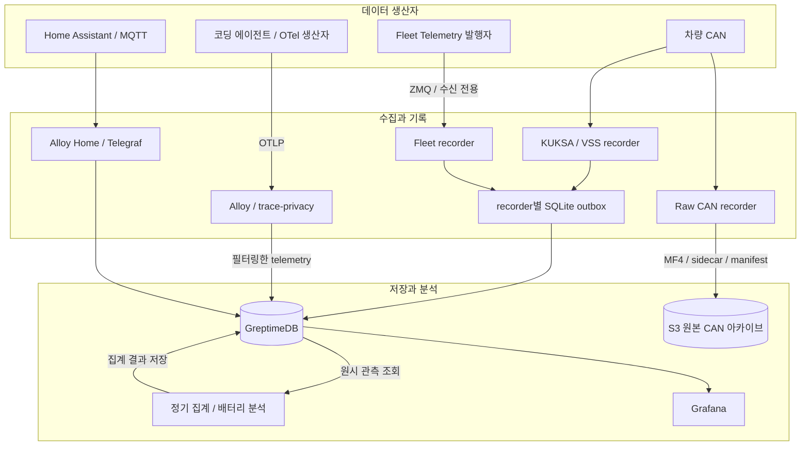
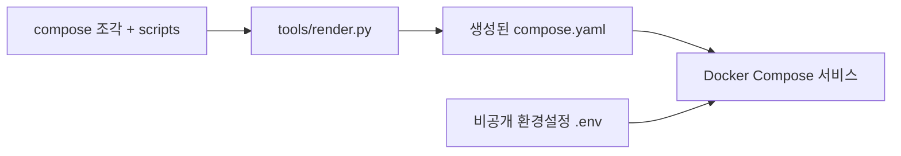

# doda_datalake

코딩 에이전트, 차량, 홈 센서의 시계열 데이터를 GreptimeDB에 모으고 Grafana에서 조회하는 셀프호스팅 데이터레이크입니다.

개인 환경을 위한 Docker Compose 기반 프로젝트입니다. 기본 서버에 필요한 수집 경로만 연결하면 됩니다.

[설치와 운영](docs/operations.md) · [코딩 에이전트 연결](plugins/README.md) · [Fleet Telemetry와 배터리 분석](docs/tesla_fleet.md) · [개발과 검증](docs/development.md)

## 무엇을 모으나요?

| 영역 | 입력 | 저장·분석하는 내용 |
| --- | --- | --- |
| 코딩 에이전트 | native OpenTelemetry와 클라이언트 플러그인 | 세션, 모델별 토큰·비용, 도구 실행 메타데이터 |
| 차량 CAN / VSS | Linux SocketCAN, DBC·VSS 정의 | 원본 CAN 아카이브, 해석된 신호, 주행·충전 집계 |
| Tesla Fleet Telemetry | 기존 ZMQ 발행자의 신호·경고·오류·연결 상태 | 가명화된 차량 관측, 이벤트 이력, 조건을 충족하는 배터리 분석 |
| 홈 | Home Assistant Prometheus, 기존 MQTT 브로커 | 센서 시계열과 명시적으로 설정한 집계 |
| 데이터레이크 운영 | DB·스토리지·수집기 메트릭 | 데이터 유입, 전송 대기열, 수집 오류, 서비스 상태 |

코딩 에이전트는 Codex, OMP, opencode2, Claude Code, AGY CLI를 지원합니다. Hermes는 별도의 [native 사용량 플러그인](plugins/hermes/README.md)을 사용하며, 공통 설치기와 활성화 방식이 다릅니다. 관측 범위는 클라이언트와 버전에 따라 달라 모든 호출과 비용을 포착한다고 가정할 수는 없습니다.

## 데이터 흐름

CAN 원본은 MF4·sidecar·manifest로 보관하고, DBC/VSS로 해석한 신호는 DB에 따로 저장합니다. 정의가 바뀌면 봉인된 원본을 오프라인에서 재해석할 수 있습니다. 차량 신호에는 수집 경로·해석 버전·관측 시각을 구분해 남기며, CAN과 Fleet 데이터를 같은 출처로 취급하지 않습니다.

누락된 값을 0이나 정상 상태로 취급하지 않습니다. 배터리 분석은 보고값·계산값·추정값과 계산 불가·실행 오류를 구분합니다.

서버 Alloy의 전송 대기열과 차량 recorder의 SQLite outbox는 수신 이후의 장애에 대비합니다. 생산자가 보내지 못한 데이터나 수신 전 ZMQ 손실까지 복구하지는 못합니다.

## 무엇을 볼 수 있나요?

Grafana 대시보드 12개를 제공합니다.

| 영역 | 대시보드 |
| --- | --- |
| 전체 / 운영 | Overview, Datalake Health |
| AI | AI Usage, AI Tools, AI Sessions |
| 차량 | 차량 개요, 배터리 모니터, 충전, 주행 |
| 차량 수집 진단 | 수집 진단 · CAN / VSS, 수집 진단 · DBC |
| 홈 | Home |

AI 화면에서는 세션·모델·도구별 사용량과 비용을 비교합니다. 비용은 클라이언트 보고값을 우선하며, 적용 가능한 경우에만 공개 가격표로 보충 추정합니다. 산정하지 못한 비용은 미산정 상태로 남습니다. 비용 정보는 청구서 대조를 대신하지 않습니다.

차량 화면에서는 주행·충전 기록과 배터리 관측·분석 근거를 확인합니다. 에너지·용량·전기 특성을 분석하려면 유효한 단위, 충분한 관측과 필요한 교정이 있어야 합니다. NASA 랩 셀 기반 수명 모델은 실험용 참조이며 Tesla 팩 수명 예측에는 사용하지 않습니다. 차량 제어·고장 확정·안전 진단 도구가 아닙니다.

## 배포 구조

서비스 정의, Python 스크립트, 수집기 설정, Grafana 대시보드를 단일 `compose.yaml`로 생성합니다. 서버 배포에는 기본적으로 생성된 Compose와 비공개 환경설정 `.env`를 사용합니다. 플러그인은 에이전트 장비에서, CAN 수집기는 차량 장비에서 실행합니다. Fleet 수집에는 별도로 운영 중인 발행자와 접근 가능한 네트워크가 필요합니다.

| 프로필 | 역할 |
| --- | --- |
| `server` | GreptimeDB, OTLP 수집·필터링, 집계, Grafana |
| `home`, `mqtt` | 서버의 선택적 홈 수집 경로 |
| `vehicle` | 별도 Linux 장비의 CAN 원본·VSS 수집 |
| `fleet` | 서버의 선택적 Fleet Telemetry 수신 |
| `backup`, `redecode` | 오프라인 백업·복원 및 CAN 재해석 작업 |

GreptimeDB는 standalone 구성입니다. 기본 저장소는 S3 호환 스토리지이며 로컬 파일 저장 모드도 있습니다. S3 모드에서도 로컬 볼륨이 필요하며, 버킷만으로 전체 DB를 복구할 수 있다고 가정하지 않습니다. 백업·복원은 DB 쓰기를 중지한 상태에서 별도로 수행합니다.

## 수집 범위와 개인정보

코딩 에이전트 플러그인은 프롬프트, 답변·추론 원문, 도구 인자·결과, 파일 내용을 전송하지 않습니다. 서버의 OTel 경로에도 메타데이터 허용 목록과 trace 개인정보 필터를 둡니다. 다만 세션·모델·도구 메타데이터만으로도 활동 패턴이 드러날 수 있으며, 가명화가 익명성을 보장하지는 않습니다.

차량 수집은 수신 전용이며 CAN 송신, Tesla 차량 명령, 정기 차량 API 폴링은 제공하지 않습니다. 물리 CAN과 특정 차량 펌웨어의 호환성은 별도로 검증해야 합니다. 홈 센서 데이터와 원본 CAN 아카이브도 개인 데이터로 취급해야 합니다.

연결 방법, 인증·보존 정책, 재전송의 한계, 백업 범위와 검증 절차는 [설치와 운영](docs/operations.md) 및 각 수집원 문서에서 확인할 수 있습니다.

## 라이선스

프로젝트 자체 코드와 문서는 [MIT License](LICENSE)를 따릅니다. 외부 정의·데이터·컨테이너·패키지는 각자의 이용 조건을 유지하며 [외부 출처 및 고지](THIRD_PARTY_NOTICES.md)에 구분되어 있습니다.

[기여 안내](CONTRIBUTING.md) · [보안 신고](SECURITY.md)
